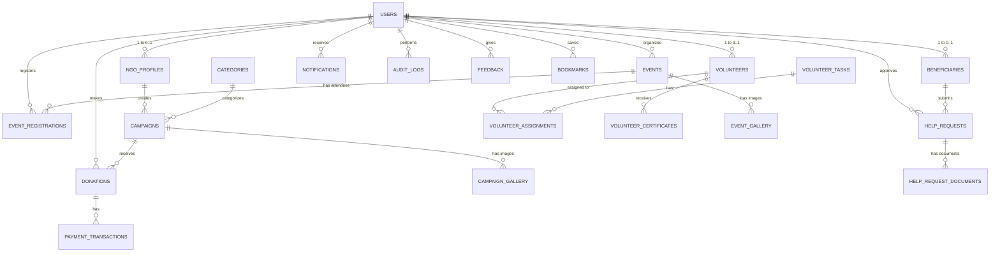

# Lifeline Database Entity Relationship Diagram

## Key Relationships Explanation

- **Users**: Central to the system. Different roles (donor, volunteer, beneficiary, ngo, admin) link a single user record to role-specific profiles (`ngo_profiles`, `volunteers`, `beneficiaries`).
- **Campaigns**: Associated with a `ngo_profile` (or NULL if admin-created) and a `category`. Donors make `donations` to `campaigns`.
- **Donations & Payments**: A 1-to-many relationship where a `donation` can have multiple `payment_transactions` (e.g., failed attempts before success).
- **Volunteering**: A `volunteer` is assigned to a `volunteer_task` via the `volunteer_assignments` junction table which also tracks hours and attendance.
- **Beneficiaries & Help Requests**: `beneficiaries` submit `help_requests` which hold status and are approved by admin `users`.
- **Events**: `users` register for `events` via `event_registrations`, which tracks both participants and volunteers for the event.
